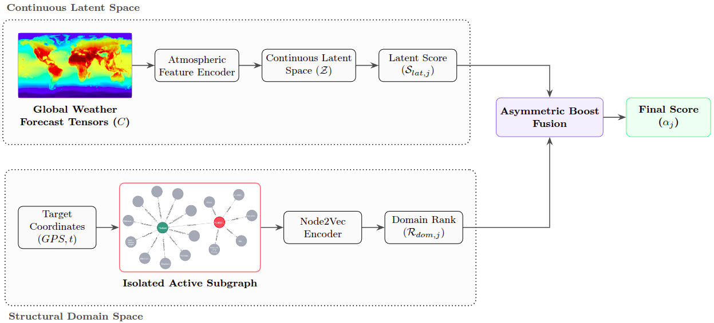

# Retrieval and Re-ranking of Weather Analogues Using a Multi-Layered Environmental Knowledge Graph

This repository contains the official implementation, architecture schemas, and evaluation pipelines for anchoring global, data-driven weather foundation models into high-resolution local environmental contexts using a dual-space grounding framework.

---

## Overview

Data-driven weather forecasting models offer improved computational efficiency but operate as black boxes ungrounded in localised environmental contexts. Because counterfactual retraining on global weather architectures is computationally prohibitive, evaluating localised historical contexts and cross-variable consistency remains a significant challenge. To address this resolution and semantic gap, we implement a dual-space retrieval and re-ranking framework that aligns continuous atmospheric latent spaces with discrete environmental domain knowledge. We evaluate a multi-axis Environmental Knowledge Graph that maps taxonomic biodiversity, urban morphology, and physical land-cover layers relative to regional disaster event coordinates. Continuous planetary states are compressed using multi-level encoder configurations trained on ERA5 data, while discrete topological properties are mapped using structured graph representation learning layers to compute a heuristic contextual re-ranking boost. Through a systematic ablation study across multiple graph projections, we quantify the specific impacts of individual environmental variables on regional fidelity. The evaluation demonstrates that the framework successfully filters out geographically proximal but ecologically divergent baseline matches, replacing them with out-of-region historical analogs that elevate average taxonomic similarity. Finally, a systematic analysis of cross-border retrieval patterns reveals that the pipeline maps continuous physical geography into consistent socio-environmental biomes. This work establishes a workflow to quantify the environmental and structural consistency of historical analogs retrieved alongside data-driven weather predictions.

---

## Architecture Framework

The dual-space architecture bridges the gap between planetary neural configurations and regional environmental footprints by running an asymmetric boost fusion over a Continuous Latent Engine and a Structural Domain Engine.

### Key Architecture Components:
1. **Continuous Latent Engine:** Maps multi-level meteorological data cubes from foundational configurations (e.g., Pangu-Weather, ERA5) into a compressed 512-dimensional manifold, isolating vertical thermodynamics and active moisture fluxes.
2. **Structural Domain Engine:** Isolates active subgraphs from a native Neo4j graph database to parameterize regional hubs across taxonomic biodiversity (iNaturalist), urban morphology (LCZ & GHSL), and physical land cover (ESA WorldCover).
3. **Asymmetric Boost Fusion:** Executes a dynamic re-ranking mechanism derived from ordinal graph ranks rather than raw topological weights, ensuring the engine remains resilient to metadata sparsity.

---

## Dataset Access

The multi-axis regional footprints, topological connectivity matrices, and socio-environmental metadata used to populate $\mathcal{G}_E$ are hosted natively on Hugging Face:

👉 **[Socio-Ecological Regions Dataset on Hugging Face Hub](https://huggingface.co/datasets/teoaivalis/socio-ecological-regions)**

---
