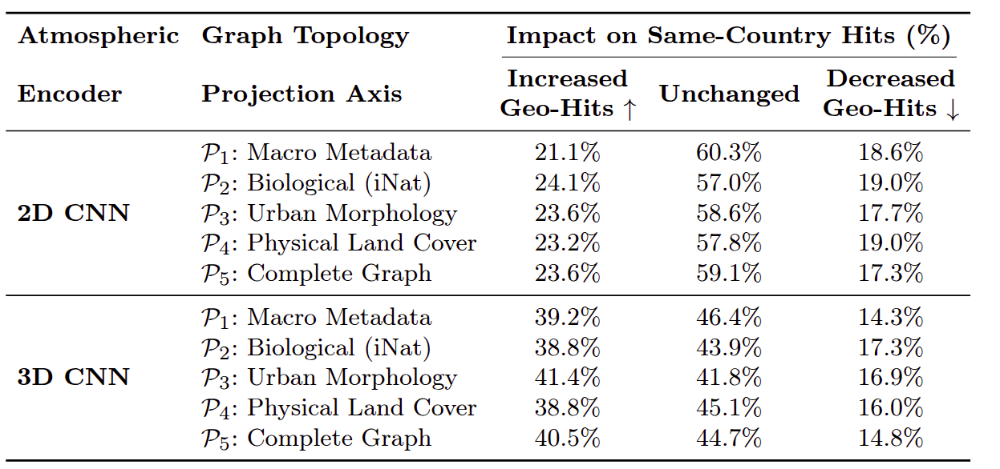

# 🧪 Topological Graph Projections & Ablation Pipelines

This directory contains the experimental framework, pre-computed continuous/discrete embeddings, and execution notebooks used to conduct the systematic sensitivity study. The pipelines isolate the relative impact of individual environmental variables on the localized fidelity of data-driven weather predictions.

---

## 📐 Ablation Schema & Graph Projections

To empirically isolate the contribution of each socio-environmental axis, the framework systematically restricts the topology of the Environmental Knowledge Graph ($\mathcal{G}_E$) during the re-ranking phase:

* **$\mathcal{P}_1$ (Macro Metadata Axis):** Enriches the latent weather states strictly with administrative indicator layers (`hasCountry`, `hasDisasterType`, `hasGlide`), completely isolating the system from high-resolution local environmental variables.
* **$\mathcal{P}_2$ (Biological Axis):** Activates the `hasBiodiversity` edge layers, pairing continuous atmospheric profiles directly with localized iNaturalist ecological and taxonomic hierarchies.
* **$\mathcal{P}_3$ (Urban Morphology & Exposure Axis):** Restricts the network topology to human exposure boundaries and structural built environments (`hasMorphology`, `hasSettlementType`, and building volume densities).
* **$\mathcal{P}_4$ (Physical Land Cover Axis):** Maps regional nodes exclusively through `hasLandCover` edges into discrete ESA WorldCover nodes to evaluate landscape moisture retention properties.
* **$\mathcal{P}_5$ (Complete Multi-Axis KG):** Activates the fully integrated topology of $\mathcal{G}_E$, allowing the asymmetric boost engine to draw multi-modal evidence simultaneously across all biological, morphological, and land-use paths.

---

## 📂 Directory Layout & Component Lineage

```text
├── ablation_2d_p[1-5].ipynb      # Evaluation notebooks for the 2D Multi-Channel Encoder configurations
├── ablation_3d_p[1-5].ipynb      # Evaluation notebooks for the 3D Volumetric Encoder configurations
├── final_results_3d_p[1-5]       # Textual logs and raw retrieval outputs for the 3D baseline models
├── final_results_p[1-5]          # Textual logs and raw retrieval outputs for the 2D baseline models
├── export_bio.csv                # Extracted validation cache for ecological similarity checks
├── export_country.csv            # Extracted validation cache for geographic boundary audits
├── graph_embeddings/             # Directory containing node vectors generated via Node2Vec random walks
├── era5_embeddings_2d.npy        # Matrix arrays containing compressed 2D continuous atmospheric states (ERA5)
├── era5_embeddings_3d.npy        # Matrix arrays containing compressed 3D continuous atmospheric states (ERA5)
├── pangu_embeddings_2d.npy       # Matrix arrays containing compressed 2D operational forecasts (Pangu-Weather)
├── pangu_embeddings_3d.npy       # Matrix arrays containing compressed 3D operational forecasts (Pangu-Weather)
└── ecological_recovery_chart.png # Visual validation chart highlighting semantic gains
```

## 📊 Benchmark Results: Dual-Space Retrieval Performance

The performance of the structural graph projections is measured by tracking how specific topological graph configurations alter geographic same-country hit rates within the critical Top 10 retrieval window ($N=237$). 

<p align="center">
  
  <br>
  <em>Figure: Performance evaluation matrix tracking geographic retrieval shifts across the 2D Multi-Channel and 3D Volumetric atmospheric encoders under distinct graph topologies ($\mathcal{P}_1$ to $\mathcal{P}_5$).</em>
</p>

### 🔍 Key Experimental Insights:
* **Dimensionality and Manifold Stability:** Transitioning from a 2D Multi-Channel to a 3D Volumetric atmospheric configuration—which explicitly preserves multi-level atmospheric thermodynamics—provides a significantly more stable latent manifold for local re-ranking. This stable physical foundation increases same-country structural adjustments from ~23% to ~40% across all projections.
* **Resolving Ecological Blindness:** Instances showing **Decreased Geo-Hits** (cross-border adjustments) do not indicate a degradation in retrieval quality. Instead, they mark critical cycles where the graph engine intentionally rejects a geographically close but ecologically divergent match, swapping it across national borders to maximize localized ecological and water runoff consistency.

---